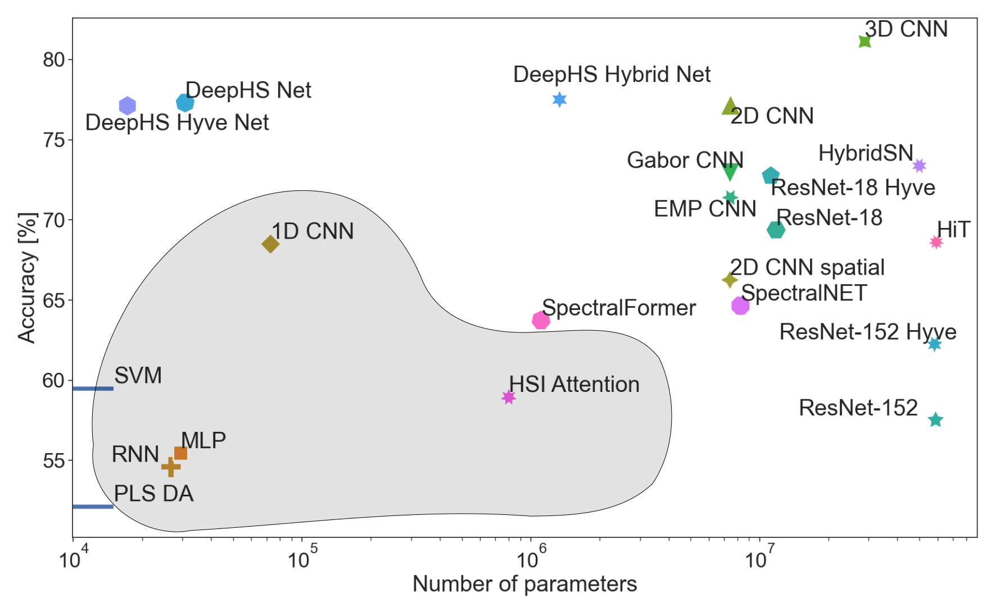
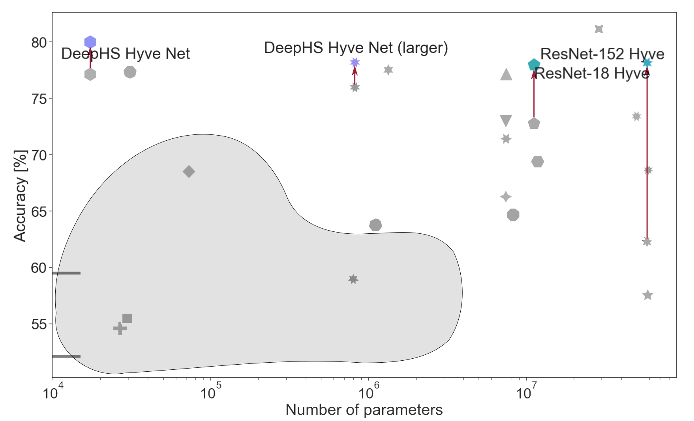

# DeepHS Benchmark: Bridging the Gap between HSI Applications through Comprehensive Dataset and Pretraining
For a comprehensive description of the benchmark we refer to the related publication.


<br>

These 23 models are currently part of the benchmark-framework:
 * SVM [0]
 * PLS-DA [1] 
 * MLP [2]
 * RNN [3]
 * 1D CNN [2]
 * 2D CNN (normal [2], spatial [2], spectral) 
 * 3D CNN [2]
 * Gabor CNN [4]
 * EMP CNN [4]
 * ResNet-18 [5] (+ HyveConv [6])
 * ResNet-152 [5] (+ HyveConv [6])
 * DeepHS-Net (+ HyveConv [6])
 * DeepHS-Hybrid-Net [7]
 * SpectralNet [8]
 * HybridSN [9]
 * Attension-based CNN [10]
 * SpectralFormer [11]
 * HiT [12]

## Download dataset
We provide a download script for Linux
`download_data_set.sh [dataset-folder]`
and Windows
`download_data_set.bat [dataset-folder]`

The data set will be downloaded into the [dataset-folder]. Around 240 GB disk space are required.


## Installation
We recommend Python version 3.10. A full list of required packages can be found in the requirements.txt file.
The packages can be installed via 
`pip install -r requirements.txt`


The code was written and tested on a Linux-based system (Ubuntu). 


## Train a model
You have to define the root-folder to be part of the PYTHONPATH.
Then you can train your first model with default configuration:  
`python classification/deep_learning.py --model deephs_net [dataset-folder]`

`python classification/deep_learning.py -h` provides the full list of options. 

## How to implement a new model

If you want to add and test a new model, 
it's best to implement it using the following guidelines:

Create your model as PyTorch-module in a separate file `classification/models/[your-model-name].py`. A good example can be found in `classification/models/mlp.py`

The constructor will receive the number of the input-channels (`num_channels`) and number of classes (`num_classes`). Additional arguments can be added in `classification/model_factory.py:_add_additional_parameters`. 
Further, the input of the forward pass has to be 
```
	x --> hyperspectral cube [batch_size, channels, spatial_x, spatial_y]
	meta_data --> dict with wavelengths and camera_type as values
```


Then, in the `classification/model_factory.py`, import and add your model to the model's list (`VALID_MODELS`), and also specify some default training parameters (`DEFAULT_HPARAMS`). We recommend using the 
```    
'[your-model-name]':
        {'batch_size': 32, 'epochs': 50, 'lr': 0.01, 'loss': 'CE','optimizer': 'Adam', 'scheduler': 'step', 'pca': False},
```

Finally, you can run `deep_learning.py` for model training and evaluation as described above.
`python classification/deep_learning.py --model [your-model-name] [dataset-folder]`

## Pretrained models

We provide pretrained model weights for the DeepHS-Net+HyveConv and the ResNet-18-HyveConv.
- [deephs_hyve_net_pretrained.pt](https://cloud.cs.uni-tuebingen.de/index.php/s/ZWKP5yNHXBJndw5)
- [resnet_hyve_pretrained.pt](https://cloud.cs.uni-tuebingen.de/index.php/s/EYyHLmtpDwcssEg)

You can directly load and evaluate these pretrained models via the `load_pretrained` argument.
    
    python deep_learning.py --model [model] --load_pretrained [path-to-pretrained-model] [dataset-folder]

There is also the option is to pretrain your own model on a user-defined set of data configurations. This you can do using `deep_learning_pretrain.py` and specifying 1. potentially many configurations to pretrain the model backbone on (`pretrain_config`), and 2. the configuration you want to fine-tune and evaluate your model on (`config`). For example, try
    
    python deep_learning_pretrain.py --model deephs_hyve_net --pretrain_config remote_sensing/salinas/0.3;remote_sensing/paviaU/0.3 --config remote_sensing/indian_pines/0.05 [dataset-folder]

This will return the classification accuracy without and with pretraining + fine-tuning. In addition, the pretrained model will be saved at a location defined via `--store_checkpoints`.

## How to cite

If you utilize our benchmark for your own research, please make sure to cite ... TODO

## References
[0]: Cristianini N, Shawe-Taylor J (2010) An Introduction to Support Vector Machines and Other
Kernel-based Learning Methods. Cambridge University Press

[1]: Barker M, Rayens W (2003) Partial least squares for discrimination. Journal of Chemometrics: A Journal of the Chemometrics Society 17(3):166–173

[2]: Paoletti ME, Haut JM, Plaza J, et al (2019) Deep learning classifiers for hyperspectral imaging: A review. Isprs Journal of Photogrammetry and Remote Sensing 158:279–317

[3]: Rumelhart DE, Hinton GE, Williams RJ (1986) Learning representations by back-propagating errors. Nature 323(6088):533–536. https://doi.org/10.1038/323533a0

[4]: Ghamisi P, Maggiori E, Li S, et al (2018) New frontiers in spectral-spatial hyperspectral image classification: The latest advances based on mathematical morphology, markov random fields, segmentation, sparse representation, and deep learning. IEEE Geoscience and Remote Sensing Magazine 6(3):10–43. https://doi.org/10.1109/MGRS.2018.2854840 

[5]: He K, Zhang X, Ren S, et al (2016) Deep residual learning for image recognition. In: 2016 IEEE Conference on Computer Vision and Pattern Recognition, CVPR 2016, Las Vegas, NV, USA, June 27-30, 2016. IEEE Computer Society, pp 770–778, https://doi.org/10.1109/CVPR.2016.90

[6]: Varga LA, Messmer M, Benbarka N, et al (2023b) Wavelength-aware 2d convolutions for hyperspectral imaging. In: IEEE/CVF Winter Conference on Applications of Computer Vision, WACV 2023, Waikoloa, HI, USA, January 2-7, 2023. IEEE, pp 3777–3786, https://doi.org/10.1109/WACV56688.2023.00378

[7]: Varga LA, Frank H, Zell A (2023a) Self-supervised pretraining for hyperspectral classification of fruit ripeness. In: 6th International Conference on Optical Characterization of Materials, OCM2023, Karlsruhe, Germany, March 22 - 23, 2023.KIT Scientific Publishing, pp 97–108

[8]: Chakraborty T, Trehan U (2021) Spectralnet: Exploring spatial-spectral waveletcnn for hyperspectral image classification. ArXiv abs/2104.00341

[9]: Roy SK, Krishna G, Dubey SR, et al (2020) Hybridsn: Exploring 3-d-2-d CNN feature hierarchy for hyperspectral image classifi-cation. IEEE Geosci Remote Sens Lett 17(2):277–281. https://doi.org/10.1109/LGRS.2019.2918719

[10]: Lorenzo PR, Tulczyjew L, Marcinkiewicz M, et al (2020) Hyperspectral band selection using attention-based convolutional neural networks. IEEE Access 8:42384–42403. https://doi.org/10.1109/ACCESS.2020.2977454

[11]: Hong D, Han Z, Yao J, et al (2022) Spectralformer: Rethinking hyperspectral image classification with transformers. IEEE Trans Geosci Remote Sens 60:1–15. https://doi.org/10.1109/TGRS.2021.3130716

[12]: Yang X, Cao W, Lu Y, et al (2022) Hyperspectral image transformer classification networks. IEEE Trans Geosci Remote Sens 60:1–15. https://doi.org/10.1109/TGRS.2022.3171551